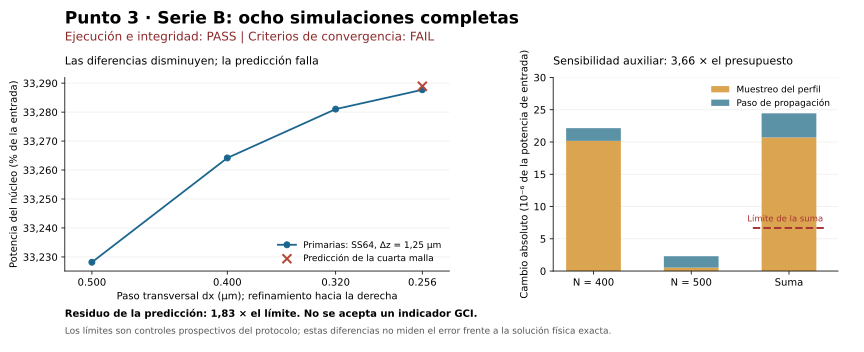

# Point 03, Stage B — 96-track refinement results

Date: 2026-10-06. **Scientific result: FAIL. Execution and integrity: PASS.**
Point 03 remains OPEN. The next work stays within this convergence question.

## What was completed

The [prospective contract](POINT-03-Q4-REFINEMENT-CONTRACT.md) and reviewed
runner/assessor were frozen at source commit
`552a93a45d1ebdba1fba97033c65b127ea733d9b` before input preparation.
All eight prescribed solutions reached z = 2 mm: 16000 propagation steps,
80 children and 80 retained checkpoints, arranged in eight verified chains.
The run took **1088.277411499992 seconds**; the longest child took
21.047309899993706 seconds. No numerical child exceeded the 40-second limit.

The [assessment](../resultados/codex/point03_refinement_20261006T220909702270Z/assessment.json) independently recomputed every
final initial/total/core-power metric from the retained NPZ arrays with
maximum discrepancy **0.0**. The [checkpoint audit](../resultados/codex/point03_refinement_20261006T220909702270Z/checkpoint_audit.json)
verified all eight complete chains and their field hashes. All **392 regular
tracked files** were unchanged during execution. These are internal
numerical/provenance checks, not external experimental replication.

Assessment SHA-256:
`94c9d3c37b339c5b9bf8c615d77f40c79d898e91c1327d24d8a11a835b0f3039`.

## Complete results, without selecting a favorable subset

The model, 96 centers, nominal 128 um width, Gaussian input, absorber and
analytic core detector follow the contract. Initial power differs from one
by at most 2.220446049250313e-16. Core powers below are normalized to input;
total powers are the raw final discrete powers. These values do not provide
a complete ADI energy-budget validation.

| Case | N | Profile samples per axis | dz (um) | Core/input power | Final total power |
| --- | --- | --- | --- | --- | --- |
| n256_ss64_z125 | 256 | 64 | 1.250 | 0.33228164377549263 | 0.7678346646583395 |
| n320_ss64_z125 | 320 | 64 | 1.250 | 0.33264174033747024 | 0.7676352197836916 |
| n400_ss64_z125 | 400 | 64 | 1.250 | 0.3328103520352122 | 0.7673901727808257 |
| n500_ss64_z125 | 500 | 64 | 1.250 | 0.3328770953095073 | 0.7672052534657238 |
| n400_ss32_z125 | 400 | 32 | 1.250 | 0.33279018211748507 | 0.7673784049633613 |
| n500_ss32_z125 | 500 | 32 | 1.250 | 0.33287656677526933 | 0.767205986853971 |
| n400_ss64_z0625 | 400 | 64 | 0.625 | 0.332808380586412 | 0.7673846984464813 |
| n500_ss64_z0625 | 500 | 64 | 0.625 | 0.3328753265194593 | 0.7671997897779468 |

The [CSV](../resultados/codex/point03_refinement_20261006T220909702270Z/cases.csv) and [compact JSON](../resultados/codex/point03_refinement_20261006T220909702270Z/compact_result.json)
provide the same values. The full assessment preserves paths, hashes,
specifications, gates and raw-field measurements.

The figure is generated from the compact data by
[`plot_point03_stageB.py`](../resultados/codex/point03_refinement_20261006T220909702270Z/plot_point03_stageB.py). It is a
descriptive plot of the observations; no fitted continuum solution or
accepted confidence band is shown.

## Spatial trend and the failed prediction

In coarse-to-fine order, the signed power changes are:

- D0 = +3.6009656197760753e-4.
- D1 = +1.6861169774196050e-4.
- D2 = +6.674327429512239e-5.

All have the same sign and decrease in magnitude. Thus the new series
passes the original-style magnitude-shrinking diagnostic. **The historical
GLASS-009d T96d Q4 FAIL is retained unchanged.** A different controlled
series cannot rewrite that historical result.

The effective observed orders are p0 = 3.400384165011342 and
p1 = 4.153133203929287. Their relative disagreement is 18.124846999989494
percent, within the prospectively specified 20-percent screen. These are
effective orders of this functional on these meshes, not a demonstrated
formal order of the solver.

The first three grids predict P500 = **0.3328893028156898**.
That prediction was also [recorded](../resultados/codex/point03_refinement_20261006T220909702270Z/prospective_prediction.json)
at 22:14:09.598855 UTC, before the fourth final case report existed.
The observed P500 is **0.3328770953095073**. Their absolute difference is
**1.2207506182471128e-5**, compared with the contract limit
**6.674327429512239e-6**. The residual is **1.8290241693106828 times**
its allowed maximum. B5 therefore fails despite its passing order-stability
subcheck. The timestamp is an internal record, not external attestation.

## Auxiliary sensitivity and its interpretation

| Grid | Profile SS32 versus SS64 | dz 0.625 versus 1.25 um | Sum |
| --- | --- | --- | --- |
| N = 400 | 2.0169917727130837e-5 | 1.9714488002087194e-6 | 2.2141366527339557e-5 |
| N = 500 | 5.285342379868219e-7 | 1.768790048040092e-6 | 2.297324286026914e-6 |

The combined sum is **2.443869081336647e-5**, or
**3.661596029182592 times** the budget of **6.674327429512239e-6**.
Each individual component is below its separate 2.5e-4 cap, but the
combined screen fails. The four-corner robustness check also fails.

The largest measured component is profile sampling at N=400. This motivates
a more precise geometric-area study. A SS32-to-SS64 difference is a
sensitivity measurement, not the error of SS64 relative to exact geometry.
It does not establish geometry as the sole cause of the prediction failure.
The longitudinal controls are smaller here; they are not identically zero.

## Gate ledger

| Requirement | Result | Meaning |
| --- | --- | --- |
| B1: eight cases, inputs, provenance and unchanged tracked evidence | PASS | Complete internally auditable execution |
| B2: shapes, finite fields, input power, detector and final-power screens | PASS | Numerical sanity, within the stated scope |
| B3: independent final-metric recomputation | PASS | Exact agreement of the retained metrics |
| B4: signed differences and positive finite observed orders | PASS | Consistent direction in these four measurements |
| B5: order stability | PASS | Relative difference below 20 percent |
| B5: fourth-grid prediction | FAIL | Residual exceeds its fixed limit |
| B6: individual auxiliary caps | PASS | Each component below 2.5e-4 |
| B6: combined auxiliary budget and corner robustness | FAIL | Auxiliary effects too large for the prescribed screen |
| B7: accepted total uncertainty indicator | NOT ACCEPTED | Prerequisites fail; accepted GCI is null |

The Boolean B7 fields are false because an accepted indicator cannot be
computed under these failed prerequisites. They **do not prove that the
actual continuum error exceeds 1e-3**. No accepted GCI, continuum limit or
experimental confidence interval is reported.

## Decision and limits

Stage B is closed as a complete negative test of its prospectively stated
acceptance conditions. Point 03 remains open. A follow-up must use a new
prospective contract, preserve these results, and address a testable cause
or improve the verification. It may not discard meshes or relax Stage B.

The immediate technical preparation is an equivalence audit of a compiled
sparse linear solver for the same ADI operator, before using it to support
additional resolution studies. A geometric follow-up should compare
analytically evaluated union/cell areas with an independent integration
method before new propagation. Neither preparation alone closes convergence.

Boundary reflection, full complex-field/phase accuracy, material validation
and physical device behavior remain outside this Stage B scope.

## Methodological references

The [NASA grid-convergence tutorial](https://www.grc.nasa.gov/www/wind/valid/tutorial/spatconv.html)
motivates checking observed order and the asymptotic regime. The
[TMR uncertainty procedure](https://tmbwg.github.io/turbmodels/Papers/uncertainty_summary.pdf)
illustrates withholding ordinary GCI for inappropriate convergence behavior.
[Eca and Hoekstra (2014)](https://doi.org/10.1016/j.jcp.2014.01.006)
discuss scatter and sensitivity in grid-refinement data, including why a
fourth point supplies information beyond a three-parameter fit. These
references inform interpretation; they do not validate this optical model,
supply our local tolerances or authorize replacing the failed contract.
