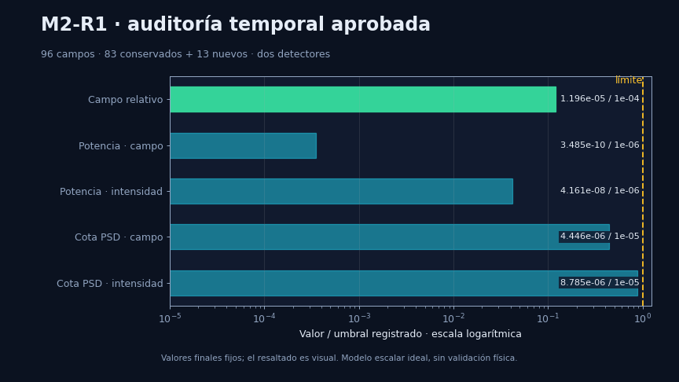
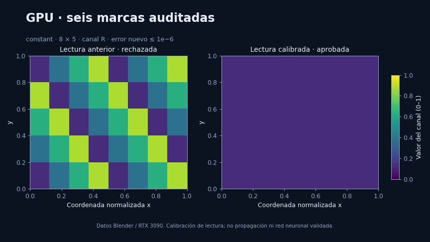
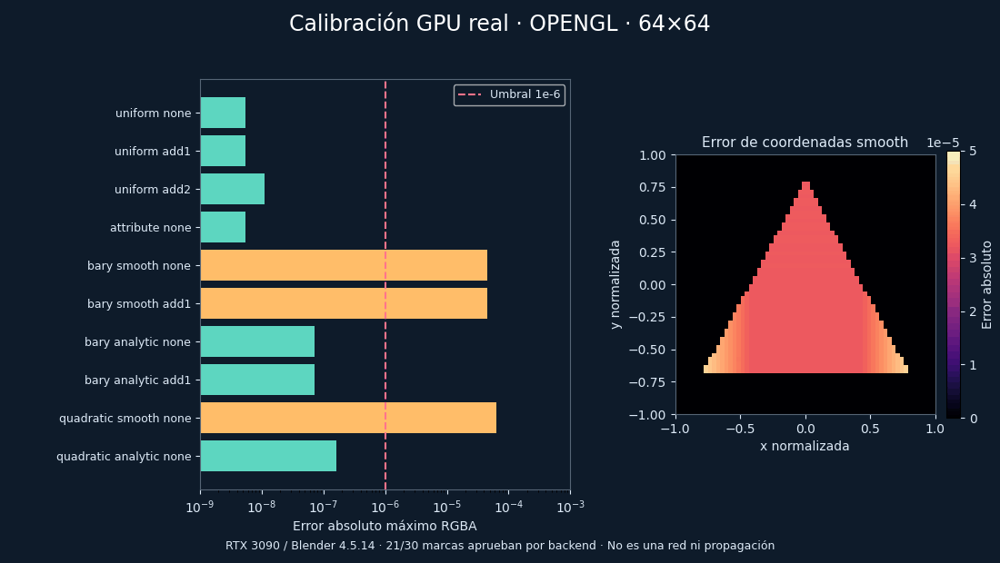
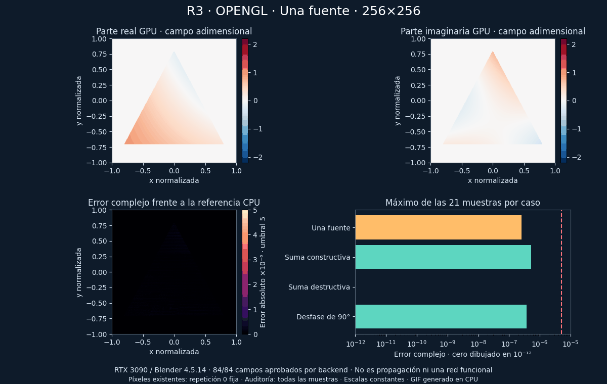
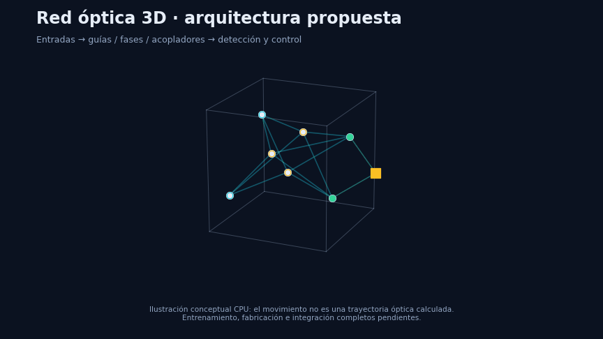

<div align="center">


**Investigación abierta sobre una red neuronal óptica 3D escrita con láser de femtosegundo en un cubo de sílice.**


[Idea](#la-idea) · [Laboratorio actual](#laboratorio-20261009) · [Cómo funciona](#cómo-funciona-en-8-gifs) · [Resultados](#resultados-hasta-hoy) · [Reproducir](#reproducir) · [Método](#método-y-colaboración) · [Hoja de ruta](#hoja-de-ruta)

</div>

---

## La idea

Escribir, dentro de un bloque de sílice fundida, **guías de onda, acopladores y elementos de fase** con un láser de femtosegundo, de modo que la propia geometría del vidrio realice un cálculo óptico. Una red entrenada en software se convertiría en parámetros fabricables (separaciones, longitudes, grosores). Se estudia también escribir desde las seis caras del cubo.

Este repositorio **no** presenta un procesador ya construido: conecta geometría y propiedades del material con cálculos verificables, primero en simulación y después, si la evidencia lo permite, en un diseño fabricable.

> **Contexto histórico (6 de octubre de 2026).** Investigación numérica en CPU y ensayos CUDA acotados. No hay dispositivo fabricado, red completa validada ni ventaja de velocidad o eficiencia demostrada. Project Silica de Microsoft ([página oficial](https://www.microsoft.com/en-us/research/project/project-silica/)) demuestra **almacenamiento** volumétrico, no procesamiento óptico: no es una réplica ni una evidencia a favor de esta idea.

<a id="laboratorio-20261009"></a>
## Laboratorio científico · 9 de octubre de 2026

**El núcleo del proyecto es nuestra red óptica dentro de un motor 3D.** La
geometría, el campo complejo, la fase y la detección deben conservar su
significado al utilizar el hardware gráfico. Las referencias CPU permiten
comprobar ese significado; el aspecto de una imagen no valida la física.

| Evidencia actual | Resultado | Alcance |
|---|---|---|
| D16 C2 / M2-R1 | Auditorías temporales aprobadas; M2 conserva 83 campos y calcula 13 nuevos | Consistencia de soluciones discretas; [M2 auditada](Docs/POINT-03-D16-M2-RESULTS.md) |
| F1, h=0,35 µm | Última lectura confirmada: 96/192 campos a las 07:45 UTC | Reconexión: el almacenamiento actual no contiene F1; resultado final sin recuperar ni auditar |
| R1 P2 en Blender/RTX 3090 | 84 fotogramas conservados; 63 fallan precisión | Lectura defectuosa y tiempos insuficientes; [negativo retenido](Docs/POINT-03-RENDER-GPU-RUN02-RESULTS.md) |
| P0, lectura gráfica calibrada | Seis marcas GPU auditadas, error máximo 6,68×10⁻⁸ | Coordenadas/canales y reloj/cierre aprobados; [calibración](Docs/POINT-03-RENDER-BUFFER-RESULTS.md) |
| R2 P2 corregido | 84 fotogramas nuevos: integridad y tiempos aprobados; 63 fallan precisión | Error máximo 1,62×10⁻⁴ >5×10⁻⁶; [negativo auditado](Docs/POINT-03-RENDER-P2-CORRECTED-RESULTS.md) |
| P1, OpenGL y Vulkan | 60 marcas nuevas; integridad aprobada, nueve fallos por backend | Coordenadas analíticas precisas; interpolación smooth negativa. [Resultados](Docs/POINT-03-RENDER-PIPELINE-RESULTS.md) |
| R3 P2 analítico | 168 campos nuevos: 84/84 aprobados en OpenGL y 84/84 en Vulkan | Error máximo 5,86×10⁻⁷ ≤5×10⁻⁶; representación y suma coherente P2. [Resultados auditados](Docs/POINT-03-RENDER-P3-ANALYTIC-RESULTS.md) |
| Software CPU | 51 pruebas aprobadas en la publicación previa | Ninguna inicialización GPU; [registro](resultados/codex/point03_main_cpu_tests_20261009/report.json) |

T96/Q4 permanece abierta: faltan F1 completa y auditada, convergencia espacial,
predicción prospectiva, malla reservada de 0,28 µm y dominio. Las etapas de
fabricación, medidas, red completa y reproducción externa siguen pendientes.

### Auditoría temporal: datos, umbrales y dos detectores



Cada barra representa un valor final fijo dividido por su umbral, en escala
logarítmica. El resaltado cambia para facilitar la lectura; **no representa
propagación temporal ni nuevos datos**. La cota PSD es el indicador numérico
registrado, no una garantía del error continuo.

### Motor gráfico: calibrar también la lectura de la GPU



Triángulos 3D, rasterización, shaders y framebuffer FP32 se ejecutaron en
Blender 4.5.14/OpenGL/RTX 3090. La calibración independiente detectó y corrigió
la interpretación del búfer. Los seis casos nuevos aprobaron; los 84 resultados
P2 anteriores permanecen negativos. Una calibración de lectura **no equivale a
una red neuronal validada**. Todos los tiempos, incluidos arranque y lectura,
se conservan y no hay ventaja general de velocidad o energía demostrada.

### OpenGL y Vulkan: precisión de las coordenadas gráficas



Cada backend aprueba 21 marcas y conserva nueve fallos. Las coordenadas
calculadas en el fragment shader pasan; las interpoladas por smooth fallan.
Calibración real del instrumento gráfico, sin red funcional ni propagación óptica.
[Datos, costes y resultados](Docs/POINT-03-RENDER-PIPELINE-RESULTS.md) ·
[Generador](tools/gif_pipeline_calibration_20261009.py) ·
[Manifiesto](resultados/codex/point03_pipeline_gif_manifest_20261009.json).

### Campos complejos P2: rasterización y superposición auditadas



OpenGL y Vulkan aprueban los 84 campos de cada ensayo, incluidos suma
constructiva, destructiva y desfase de 90°. Los triángulos 3D se rasterizan;
el fragment shader calcula el campo complejo y la suma coherente conserva
su fase. El GIF muestra píxeles ya calculados, con escala constante y
repetición cero fijada; las barras incluyen las 21 muestras de cada caso.
Es un banco manufacturado de representación P2, sin propagación guiada ni
una red funcional. Todos los costes de preparación, arranque, dibujo y
lectura se publican; no hay ventaja general o energética demostrada.
[168 crudos, auditorías y costes](Docs/POINT-03-RENDER-P3-ANALYTIC-RESULTS.md) ·
[Generador](tools/gif_p3_analytic_v2_20261009.py) ·
[Manifiesto](resultados/codex/point03_p3_gif_manifest_v2_20261009.json).

### Arquitectura de la red que queremos comprobar



**Ilustración conceptual CPU, rotulada en cada fotograma.** Los puntos muestran
el flujo propuesto, sin afirmar trayectorias ópticas calculadas. La red pasiva
es lineal en campo; detección, no linealidad y control deben declararse y
validarse como parte del sistema completo. Entrenamiento, compilador a
geometría fabricable e integración completos están pendientes.

Las animaciones se generan con [el generador reproducible](tools/gif_scientific_snapshot_20261009.py).
[Manifiesto de entradas, versiones y hashes](resultados/codex/point03_readme_gif_manifest_v2_20261009.json).
Se conservan también los GIF y la fuente anteriores a la revisión visual.

### Aceleración gráfica: aplicar y comprobar, antes de afirmar ventajas

Utilizamos rasterización nativa, interpolación geométrica, shaders de campo
complejo, geometría preparada y almacenamiento FP32. Vulkan ya se ejecutó en esta calibración; evaluaremos
instancing, transferencia asíncrona y BVH/RT cuando correspondan al subproblema,
con protocolo previo y comparación de precisión/coste completo. Los núcleos RT
pueden acelerar intersecciones; el campo coherente y la propagación requieren
un modelo óptico propio comprobado. [Tecnologías, evidencia y siguiente ensayo](Docs/GRAPHICS-ACCELERATION-20261009.md).

Los ocho GIF históricos siguientes mantienen sus datos y fechas originales.

## Cómo funciona en 8 GIFs

Todos los GIF de esta sección se generan con `tools/` a partir de los datos y experimentos del repositorio. Lo conceptual se rotula como ilustración.

### 1 · El láser dibuja la camisa; el núcleo queda intacto


Un núcleo de sílice sin modificar se rodea de **trazos de índice reducido** ("depressed cladding"). Aquí, tres coronas de discos de 1,25 µm (geometría del ensayo GLASS-007). Con 32 trazos por corona el anillo queda relleno al 95 %; con 16, al 69 %.

### 2 · ¿La camisa retiene la luz?


Un haz se propaga 2 mm. Con contraste débil (δn = −0,001) se abre; con δn = −0,005 queda mayoritariamente en el núcleo (1,2 % / 36,4 % / 72,6 %). Resultado de un solver radial independiente del BPM. **Modelo escalar ideal**, no una guía medida.

### 3 · La fuga cae exponencialmente con el grosor


El modo es *cuasi-ligado*: escapa por efecto túnel a través de la camisa. Duplicar el grosor reduce la fuga ~100×, y la predicción WKB fijada antes de medir acierta (×107 previsto, ×101 observado). Con núcleo de 6 µm y δn = −0,005, unos 12 µm de camisa continua dan 0,044 dB/cm **en el modelo**.

### 4 · Una malla de acopladores calcula una transformada


Dos etapas de acopladores 50/50 con fases fijas realizan una DFT de 4 puntos. El oráculo es álgebra lineal pura; el simulador integra modos acoplados por tramos. **Backend a matriz**, etiquetado como tal: no es un trazado de la escena.

### 5 · La media engaña: importa el 95 % de las piezas


Con ruido de fase σ = 0,10 rad la *media* del error ronda el 11 %, pero más de la mitad de las piezas superan el 10 %. Para que el 95 % cumpla hace falta σ ≈ 0,05 rad, es decir δn ≈ 10⁻⁶ en 10 mm. Por eso el diseño necesita **recorte tras escribir o calefactores**.

### 6 · Menos trazos, más fuga (y los huecos duelen)


96 trazos se acercan a la camisa continua (33 % vs 35 % en 007; con observable e índice corregidos, GLASS-009d, 33,2 % vs 36,3 %, un ~8 % menos); 48 pierden más de la mitad; un hueco nominal de 30° abre en realidad 17,7° y hunde la potencia. Datos del BPM de GLASS-007.

### 7 · Dos solvers independientes


Un BPM (FFT) y un ADI Crank–Nicolson (diferencias finitas) coinciden en ≤ 0,24 puntos en cinco perfiles con máscaras idénticas. **Pero** comparten un sesgo del observable (el núcleo en píxeles de 0,5 µm ocupa el 96,6 % del área exacta) y varios controles del método **fallan**; están retenidos.

### 8 · Método: contrato, ejecución, auditoría, fallos retenidos


Cada ensayo se congela **antes** de medir. Los fallos no se ocultan ni se relajan: se publican junto a su causa.

## Resultados hasta hoy

El [inventario actual](Docs/PROJECT-STATUS.md) distingue ejecución, criterios aprobados, fallos y límites. Los informes y GIF anteriores conservan su fecha y su versión; no se reinterpretan como mediciones de un dispositivo.

| Hito | Resultado documentado | Estado y límite |
|---|---|---|
| Entorno CPU | Instalación aislada, seis versiones fijadas, 51 pruebas ejecutadas | PASS en Windows 10 / Python 3.13.7; [informe](Docs/POINT-01-RESULTS.md) |
| GLASS-001/002 | Viabilidad e implementación ideal de intensidad DFT4 | Modelo CMT; fases de salida y diferencia media/p95 explícitas |
| GLASS-003 V1/V2 | Balance y propagación escalar; V2 tiene 15 casos | Fallos originales conservados; −0,005 falla dominio y dz |
| GLASS-004 | CMT frente a acopladores analíticos | Nominal/controles PASS; error de campo ≈2e-16; ruido hipotético |
| GLASS-005 | Referencia radial m=0 y diagnóstico de paso longitudinal | Casos seleccionados; receta SK1310 y mediciones pendientes |
| GLASS-006a | 20 geometrías, 18 modos seleccionados | G2: 7 PASS / 11 FAIL; dos casos sin modo seleccionado |
| GLASS-006b | Piloto de acoplador ejecutado: 12 casos CPU | Linealidad/simetría y controles parciales PASS; dx y reducción gaussiana FAIL |
| GLASS-007 V1/V2 | Trazos discretos; V2 con cobertura y detector parcial | V2: 13 casos y criterios propios PASS; frontera/global pendientes |
| GLASS-008/009 | Geometría y segundo propagador ADI | Acuerdos parciales; K1/K2/K4-dx/K5 históricos conservados |
| GLASS-009b/d | Corrección del observable y perfil por cobertura | P3 de 009b y Q4 de 96 trazos de 009d siguen FAIL |
| GLASS-009c | Ejecutado: campo complejo en vacío, incluida fase | Validación parcial por ángulo, dominio y distancia; reflexión aislada pendiente |
| GLASS-010 | Seis casos y 24 comparaciones M4 aprobadas | No resuelve todo el barrido 006a; interferencia modo/resto requiere corrección |
| GLASS-GPU-001 | Ocho salidas CUDA, comparadas con CPU | Cuatro complex128 PASS y cuatro complex64 FAIL |
| GLASS-GPU-002 | Ocho casos adicionales complex128 | Criterios locales PASS; sin convergencia global ni contraste ADI independiente |
| MEGA-001 | 24 impactos afines y cuatro criterios analíticos CPU | PASS del diagnóstico; metadatos Vulkan no equivalen a ejecución RT |

Detalle en [`Docs/`](Docs/), [`coordinacion/respuestas/`](coordinacion/respuestas/) y [`resultados/`](resultados/).

La [réplica independiente V2](Docs/GLASS-007-V2-RESULTS.md) confirma que
96 trazos retienen un 8,5 % menos potencia en el núcleo que el continuo. La
misma réplica separa el efecto de promediar el índice del efecto del detector.
Los GIF anteriores conservan datos de V1: no son figuras de V2. No se han certificado
frontera, convergencia global ni fabricación. Ambos fallos de escritura
propios se conservan junto a la continuación por hashes, sin repetir cuatro
casos válidos.

### Qué **no** demuestra el repositorio

- Ninguna guía real: los perfiles son ideales (escalar, paraxial, sin polarización, reflexión, curvas, rugosidad ni tensión).
- Ninguna pérdida por cm medida; el anillo continuo es una referencia de modelo, no una cota universal.
- Ninguna red neuronal fabricable: una malla pasiva es **lineal en campo**; la no linealidad, la detección y la electrónica quedan fuera del cubo y deben declararse aparte.
- Ninguna ventaja de velocidad/eficiencia frente a otras redes.

## Estructura

```
Silice-Neuro3D-Cube/
├── src/silice/        biblioteca (7 módulos): bpm.py (BPM escalar paraxial), tracks.py (trazos
│                      discretos), coupler.py (acoplamiento CMT), coverage.py (área parcial y
│                      cobertura), gpu_bpm.py y gpu_refinement.py (ensayos CUDA acotados)        [Codex]
├── tests/             12 ficheros, 51 pruebas CPU                                                [Codex]
├── scripts/           200 ficheros: ensayos, auditorías, verificación (check.py) [Codex]
├── experimentos/      ensayos por hito de Claude (glass_min1, glass005…glass010) [Claude]
├── tools/             11 generadores de los GIF del README a partir de los datos
├── assets/            GIF y cabecera del README
├── resultados/codex/  informes JSON con parámetros, hashes y criterios (evidencia retenida)
├── Docs/              contratos, resultados, revisiones y estado (168 Markdown)
├── coordinacion/      checkpoint, tablón, cola, respuestas y tareas de los agentes
├── requirements/      bloqueos de dependencias con hash (Windows x64, CPython 3.13)
├── pyproject.toml     metadatos del paquete silice-neuro3d-cube
└── AGENTS.md          reglas de colaboración entre agentes y revisión
```

## Reproducir

La instalación reproducible de CPU utiliza Windows 10 x64 y CPython 3.13.7. Desde la raíz del repositorio:

```powershell
& 'C:\Python313\python.exe' scripts/bootstrap_cpu.py
```

El comando instala seis dependencias con versiones y hashes fijados dentro de `.venv`, instala el paquete y ejecuta la verificación completa del entorno. Las instrucciones y la opción de instalación sin conexión están en [CPU-REPRODUCTION](Docs/CPU-REPRODUCTION.md).

Para repetir la verificación sin reinstalar, o ejecutar solo las 51 pruebas CPU actuales:

```powershell
& '.\.venv\Scripts\python.exe' scripts/verify_environment.py
& '.\.venv\Scripts\python.exe' -B scripts/check.py
```

La verificación genera informes nuevos, comprueba los hashes de la evidencia histórica y limita cada proceso numérico a un hilo y 40 segundos. Incluye las pruebas, la auditoría CMT, la auditoría de GLASS-007 V2 y los 15 casos de GLASS-003 V2. El fallo científico de convergencia de GLASS-003 V2 debe reproducirse con resultados completos y balances correctos; no se convierte en una convergencia aprobada. Las instrucciones históricas de cada ensayo conservan su propio alcance y sus límites. Esta instalación no ejecuta GPU ni Blender.

## Método y colaboración

Leer el [contrato de investigación](Docs/RESEARCH-CONTRACT.md), el [checkpoint](coordinacion/CHECKPOINT.md) y el [tablón](coordinacion/TABLON.md). Codex y Claude tienen tareas independientes y revisan evidencia mutuamente. **JEV no cuenta como consultado sin `provenance=jev`**: su canal sigue bloqueado por seguridad y se usa un fallback local explícito. El proyecto anterior `9_NEBULA_NEW` queda intacto.

Reglas: contrato antes de medir · umbrales no se relajan después · fallos retenidos · visualización, modelo matemático, simulación y dispositivo físico se distinguen siempre · sin GPU/Blender sin ventana y reserva exclusiva.

## Hoja de ruta

- [x] BPM escalar paraxial + segundo solver radial + solver 2D independiente
- [x] Camisa continua y de trazos discretos (modelo ideal)
- [x] Observable con área parcial y perfil por cobertura (009b/d, réplica GLASS-007 V2)
- [ ] Completar frontera y fase en guías: 009c ejecutado con validación parcial en vacío
- [ ] Perfiles/trazos medidos de SK1310 (necesita el PDF completo) y modos reales
- [ ] Cerrar el acoplador: piloto GLASS-006b ejecutado; base modal y contraste independiente pendientes
- [ ] Curvas, registro entre caras, tolerancias correlacionadas y calibración
- [ ] Red 3D pequeña con tarea congelada, separando detección y no linealidad
- [ ] Fabricación: fuera del alcance actual

Repositorio remoto: [`Agnuxo1/Silice-Neuro3D-Cube`](https://github.com/Agnuxo1/Silice-Neuro3D-Cube) (repositorio público; los resultados revisados se publican en **main**. La **licencia** sigue pendiente).
