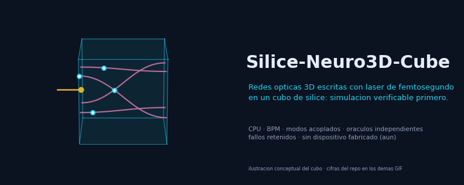
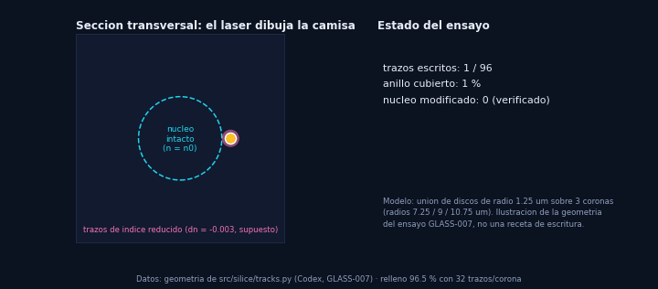
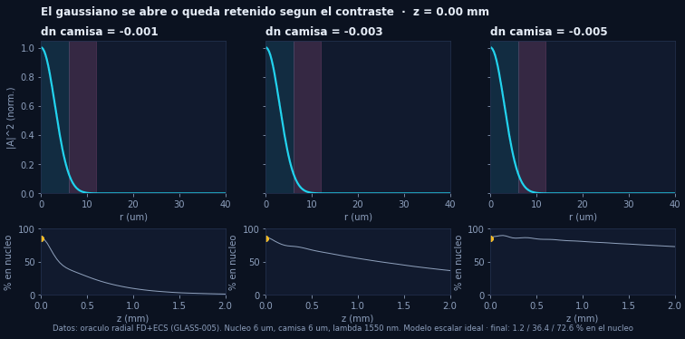
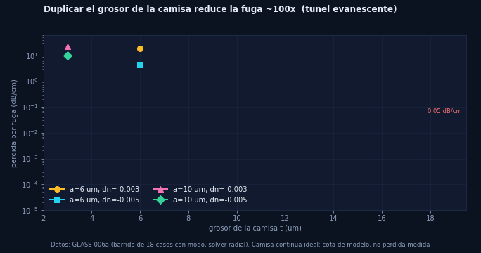
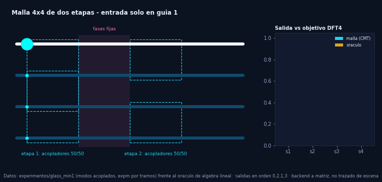
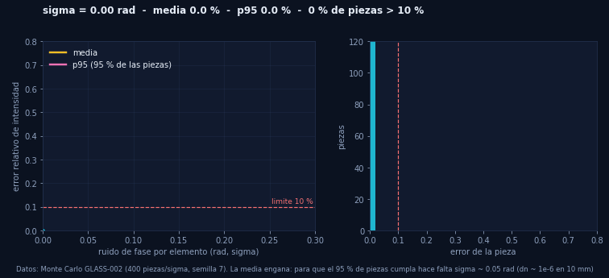
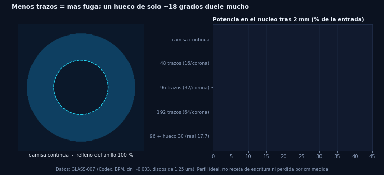
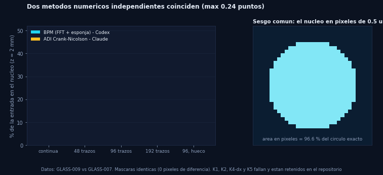
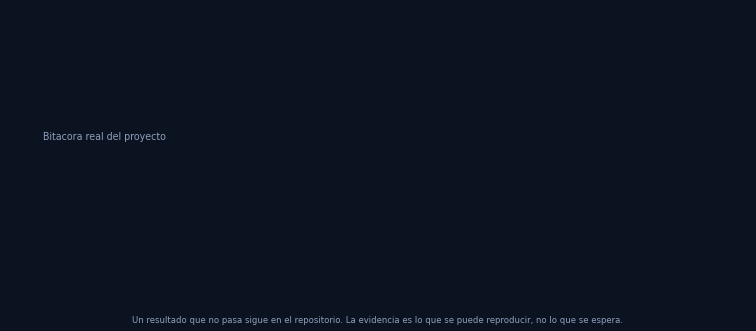

<div align="center">



**Investigación abierta sobre una red neuronal óptica 3D escrita con láser de femtosegundo en un cubo de sílice.**


[Idea](#la-idea) · [Cómo funciona](#cómo-funciona-en-8-gifs) · [Resultados](#resultados-hasta-hoy) · [Reproducir](#reproducir) · [Método](#método-y-colaboración) · [Hoja de ruta](#hoja-de-ruta)

</div>

---

## La idea

Escribir, dentro de un bloque de sílice fundida, **guías de onda, acopladores y elementos de fase** con un láser de femtosegundo, de modo que la propia geometría del vidrio realice un cálculo óptico. Una red entrenada en software se convertiría en parámetros fabricables (separaciones, longitudes, grosores). Se estudia también escribir desde las seis caras del cubo.

Este repositorio **no** presenta un procesador ya construido: conecta geometría y propiedades del material con cálculos verificables, primero en simulación y después, si la evidencia lo permite, en un diseño fabricable.

> **Estado actualizado (6 de octubre de 2026).** Investigación numérica en CPU y ensayos CUDA acotados. No hay dispositivo fabricado, red completa validada ni ventaja de velocidad o eficiencia demostrada. Project Silica de Microsoft ([página oficial](https://www.microsoft.com/en-us/research/project/project-silica/)) demuestra **almacenamiento** volumétrico, no procesamiento óptico: no es una réplica ni una evidencia a favor de esta idea.

## Cómo funciona en 8 GIFs

Todos los GIF de esta sección se generan con `tools/` a partir de los datos y experimentos del repositorio. Lo conceptual se rotula como ilustración.

### 1 · El láser dibuja la camisa; el núcleo queda intacto



Un núcleo de sílice sin modificar se rodea de **trazos de índice reducido** ("depressed cladding"). Aquí, tres coronas de discos de 1,25 µm (geometría del ensayo GLASS-007). Con 32 trazos por corona el anillo queda relleno al 95 %; con 16, al 69 %.

### 2 · ¿La camisa retiene la luz?



Un haz se propaga 2 mm. Con contraste débil (δn = −0,001) se abre; con δn = −0,005 queda mayoritariamente en el núcleo (1,2 % / 36,4 % / 72,6 %). Resultado de un solver radial independiente del BPM. **Modelo escalar ideal**, no una guía medida.

### 3 · La fuga cae exponencialmente con el grosor



El modo es *cuasi-ligado*: escapa por efecto túnel a través de la camisa. Duplicar el grosor reduce la fuga ~100×, y la predicción WKB fijada antes de medir acierta (×107 previsto, ×101 observado). Con núcleo de 6 µm y δn = −0,005, unos 12 µm de camisa continua dan 0,044 dB/cm **en el modelo**.

### 4 · Una malla de acopladores calcula una transformada



Dos etapas de acopladores 50/50 con fases fijas realizan una DFT de 4 puntos. El oráculo es álgebra lineal pura; el simulador integra modos acoplados por tramos. **Backend a matriz**, etiquetado como tal: no es un trazado de la escena.

### 5 · La media engaña: importa el 95 % de las piezas



Con ruido de fase σ = 0,10 rad la *media* del error ronda el 11 %, pero más de la mitad de las piezas superan el 10 %. Para que el 95 % cumpla hace falta σ ≈ 0,05 rad, es decir δn ≈ 10⁻⁶ en 10 mm. Por eso el diseño necesita **recorte tras escribir o calefactores**.

### 6 · Menos trazos, más fuga (y los huecos duelen)



96 trazos se acercan a la camisa continua (33 % vs 35 % en 007; con observable e índice corregidos, GLASS-009d, 33,2 % vs 36,3 %, un ~8 % menos); 48 pierden más de la mitad; un hueco nominal de 30° abre en realidad 17,7° y hunde la potencia. Datos del BPM de GLASS-007.

### 7 · Dos solvers independientes



Un BPM (FFT) y un ADI Crank–Nicolson (diferencias finitas) coinciden en ≤ 0,24 puntos en cinco perfiles con máscaras idénticas. **Pero** comparten un sesgo del observable (el núcleo en píxeles de 0,5 µm ocupa el 96,6 % del área exacta) y varios controles del método **fallan**; están retenidos.

### 8 · Método: contrato, ejecución, auditoría, fallos retenidos



Cada ensayo se congela **antes** de medir. Los fallos no se ocultan ni se relajan: se publican junto a su causa.

## Resultados hasta hoy

El [inventario actual](Docs/PROJECT-STATUS.md) distingue ejecución, criterios aprobados, fallos y límites. Los informes y GIF anteriores conservan su fecha y su versión; no se reinterpretan como mediciones de un dispositivo.

| Hito | Resultado documentado | Estado y límite |
|---|---|---|
| Entorno CPU | Instalación aislada, seis versiones fijadas, 51 pruebas ejecutadas | PASS en Windows 10 / Python 3.13.7; [informe](Docs/POINT-01-RESULTS.md) |
| GLASS-001/002 | Viabilidad e implementación ideal de intensidad DFT4 | Modelo CMT; fases de salida y diferencia media/p95 explícitas |
| GLASS-003 V1/V2 | Balance y propagación escalar; V2 tiene 15 casos | Fallos originales conservados; −0,005 falla dominio y dz |
| GLASS-004 | CMT frente a acopladores analíticos | Nominal/controles PASS; error de campo ≈2e-16; ruido hipotético |
| GLASS-005 | Referencia radial m=0 y diagnóstico de paso longitudinal | Casos seleccionados; receta SK1310 y mediciones pendientes |
| GLASS-006a | 20 geometrías, 18 modos seleccionados | G2: 7 PASS / 11 FAIL; dos casos sin modo seleccionado |
| GLASS-006b | Piloto de acoplador ejecutado: 12 casos CPU | Linealidad/simetría y controles parciales PASS; dx y reducción gaussiana FAIL |
| GLASS-007 V1/V2 | Trazos discretos; V2 con cobertura y detector parcial | V2: 13 casos y criterios propios PASS; frontera/global pendientes |
| GLASS-008/009 | Geometría y segundo propagador ADI | Acuerdos parciales; K1/K2/K4-dx/K5 históricos conservados |
| GLASS-009b/d | Corrección del observable y perfil por cobertura | P3 de 009b y Q4 de 96 trazos de 009d siguen FAIL |
| GLASS-009c | Ejecutado: campo complejo en vacío, incluida fase | Validación parcial por ángulo, dominio y distancia; reflexión aislada pendiente |
| GLASS-010 | Seis casos y 24 comparaciones M4 aprobadas | No resuelve todo el barrido 006a; interferencia modo/resto requiere corrección |
| GLASS-GPU-001 | Ocho salidas CUDA, comparadas con CPU | Cuatro complex128 PASS y cuatro complex64 FAIL |
| GLASS-GPU-002 | Ocho casos adicionales complex128 | Criterios locales PASS; sin convergencia global ni contraste ADI independiente |
| MEGA-001 | 24 impactos afines y cuatro criterios analíticos CPU | PASS del diagnóstico; metadatos Vulkan no equivalen a ejecución RT |

Detalle en [`Docs/`](Docs/), [`coordinacion/respuestas/`](coordinacion/respuestas/) y [`resultados/`](resultados/).

La [réplica independiente V2](Docs/GLASS-007-V2-RESULTS.md) confirma que
96trazos retienen un8.5% menos potencia en núcleo que el continuo y separa
el efecto de promediar el índice del efecto del detector. Los GIF anteriores
conservan datosV1: no son figuras deV2. No se han certificado frontera,
convergencia global ni fabricación. Ambos fallos de escritura propios se
conservan junto a la continuación por hashes, sin repetir cuatro casos válidos.

### Qué **no** demuestra el repositorio

- Ninguna guía real: los perfiles son ideales (escalar, paraxial, sin polarización, reflexión, curvas, rugosidad ni tensión).
- Ninguna pérdida por cm medida; el anillo continuo es una referencia de modelo, no una cota universal.
- Ninguna red neuronal fabricable: una malla pasiva es **lineal en campo**; la no linealidad, la detección y la electrónica quedan fuera del cubo y deben declararse aparte.
- Ninguna ventaja de velocidad/eficiencia frente a otras redes.

## Estructura

```
Silice-Neuro3D-Cube/
├── assets/                 GIF del README (generados por tools/)
├── tools/                  scripts que generan los GIF a partir de los datos
├── src/silice/             BPM escalar paraxial (bpm.py) y trazos discretos (tracks.py)   [Codex]
├── scripts/  tests/        ensayos, auditorías y 51 pruebas CPU                              [Codex]
├── experimentos/
│   ├── glass_min1/         DFT4 por modos acoplados y Monte Carlo                            [Claude]
│   ├── glass005_claude/    solver radial FD + escalado complejo exterior                     [Claude]
│   ├── glass006a_claude/   fuga vs grosor, contrato, fe de erratas, resultados               [Claude]
│   └── glass009_claude/    solver 2D ADI Crank–Nicolson independiente                        [Claude]
├── resultados/codex/       informes JSON con parámetros, hashes y gates
├── Docs/                   contratos, resultados y revisiones
└── coordinacion/           checkpoint, tablón, cola, respuestas y tareas
```

## Reproducir

La instalación reproducible de CPU utiliza Windows 10 x64 y CPython 3.13.7. Desde la raíz del repositorio:

```powershell
& 'C:\Python313\python.exe' scripts/bootstrap_cpu.py
```

El comando instala seis dependencias con versiones y hashes fijados dentro de `.venv`, instala el paquete y ejecuta la verificación completa del entorno. Las instrucciones y la opción de instalación sin conexión están en [CPU-REPRODUCTION](Docs/CPU-REPRODUCTION.md).

Para repetir la verificación sin reinstalar, o ejecutar solo las 51 pruebas CPU actuales:

```powershell
& '.\.venv\Scripts\python.exe' scripts/verify_environment.py
& '.\.venv\Scripts\python.exe' -B scripts/check.py
```

La verificación genera informes nuevos, comprueba los hashes de la evidencia histórica y limita cada proceso numérico a un hilo y 40 segundos. Incluye las pruebas, la auditoría CMT, la auditoría de GLASS-007 V2 y los 15 casos de GLASS-003 V2. El fallo científico de convergencia de GLASS-003 V2 debe reproducirse con resultados completos y balances correctos; no se convierte en una convergencia aprobada. Las instrucciones históricas de cada ensayo conservan su propio alcance y sus límites. Esta instalación no ejecuta GPU ni Blender.

## Método y colaboración

Leer el [contrato de investigación](Docs/RESEARCH-CONTRACT.md), el [checkpoint](coordinacion/CHECKPOINT.md) y el [tablón](coordinacion/TABLON.md). Codex y Claude tienen tareas independientes y revisan evidencia mutuamente. **JEV no cuenta como consultado sin `provenance=jev`**: su canal sigue bloqueado por seguridad y se usa un fallback local explícito. El proyecto anterior `9_NEBULA_NEW` queda intacto.

Reglas: contrato antes de medir · umbrales no se relajan después · fallos retenidos · visualización, modelo matemático, simulación y dispositivo físico se distinguen siempre · sin GPU/Blender sin ventana y reserva exclusiva.

## Hoja de ruta

- [x] BPM escalar paraxial + segundo solver radial + solver 2D independiente
- [x] Camisa continua y de trazos discretos (modelo ideal)
- [x] Observable con área parcial y perfil por cobertura (009b/d, réplica007V2)
- [ ] Completar frontera y fase en guías: 009c ejecutado con validación parcial en vacío
- [ ] Perfiles/trazos medidos de SK1310 (necesita el PDF completo) y modos reales
- [ ] Cerrar el acoplador: piloto GLASS-006b ejecutado; base modal y contraste independiente pendientes
- [ ] Curvas, registro entre caras, tolerancias correlacionadas y calibración
- [ ] Red 3D pequeña con tarea congelada, separando detección y no linealidad
- [ ] Fabricación: fuera del alcance actual

Repositorio remoto: [`Agnuxo1/Silice-Neuro3D-Cube`](https://github.com/Agnuxo1/Silice-Neuro3D-Cube) (actualmente **privado**; hacerlo público es una decisión pendiente del autor, igual que la **licencia**, aún sin elegir).
